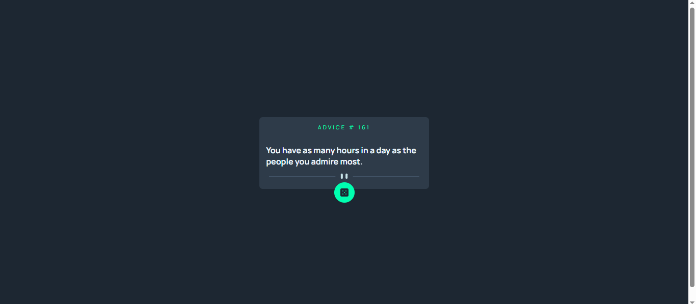

# Frontend Mentor - Advice generator app solution

This is a solution to the [Advice generator app challenge on Frontend Mentor](https://www.frontendmentor.io/challenges/advice-generator-app-QdUG-13db). Frontend Mentor challenges help you improve your coding skills by building realistic projects.

## Table of contents

- [Overview](#overview)
  - [Screenshot](#screenshot)
  - [Links](#links)
  - [Built with](#built-with)
  - [What I learned](#what-i-learned)
  - [Continued development](#continued-development)
- [Author](#author)

## Overview

### The challenge

Users should be able to:

- View the optimal layout for the app depending on their device's screen size
- See hover states for all interactive elements on the page
- Generate a new piece of advice by clicking the dice icon

### Screenshot

### Links

- Solution URL: [https://github.com/atilolaann/advice-generator-app]
- Live Site URL: [https://advicegeneratapp.netlify.app/]

## My process

### Built with

- Semantic HTML5 markup
- CSS custom properties
- Flexbox
- Javascript
- Fetch API

### What I learned

This project was my first time working with the Fetch API to retrieve data from an external source. I learned how to make a request to the Advice Slip API, extract data from the JSON response, and dynamically update the DOM with the result.

### Continued development
In future projects, I want to continue practicing the Fetch API and get more comfortable working with different REST APIs. I also want to improve my understanding of CSS positioning, particularly how absolute and relative positioning work together, since that was a tricky part of this project.

## Author

- Website - [ATILOLA]
- Frontend Mentor - [@atilolaann]
- Twitter - [@Atilola_Jesu]
- GitHub - @atilolaann
